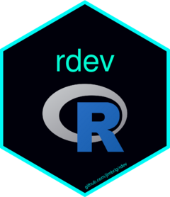

# rdev <a href="http://docs.jimbrig.com/rdev/"></a>

<!-- badges: start -->
[](https://github.com/jimbrig/rdev/actions/workflows/changelog.yml)
[](https://github.com/jimbrig/rdev/actions/workflows/pkgdown.yml)
<!-- badges: end -->

The goal of rdev is to ...

## Installation

You can install the development version of rdev from [GitHub](https://github.com/) with:

``` r
# install.packages("pak")
pak::pak("jimbrig/rdev")
```

## Example

This is a basic example which shows you how to solve a common problem:

``` r
library(rdev)
## basic example code
```

